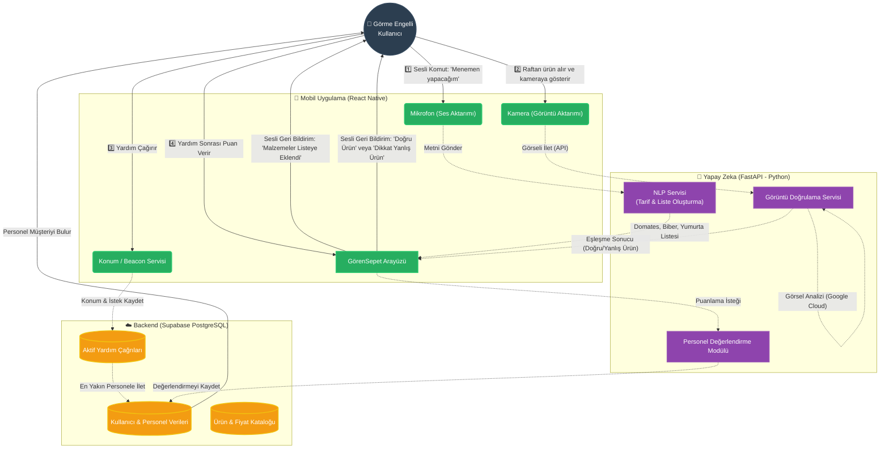
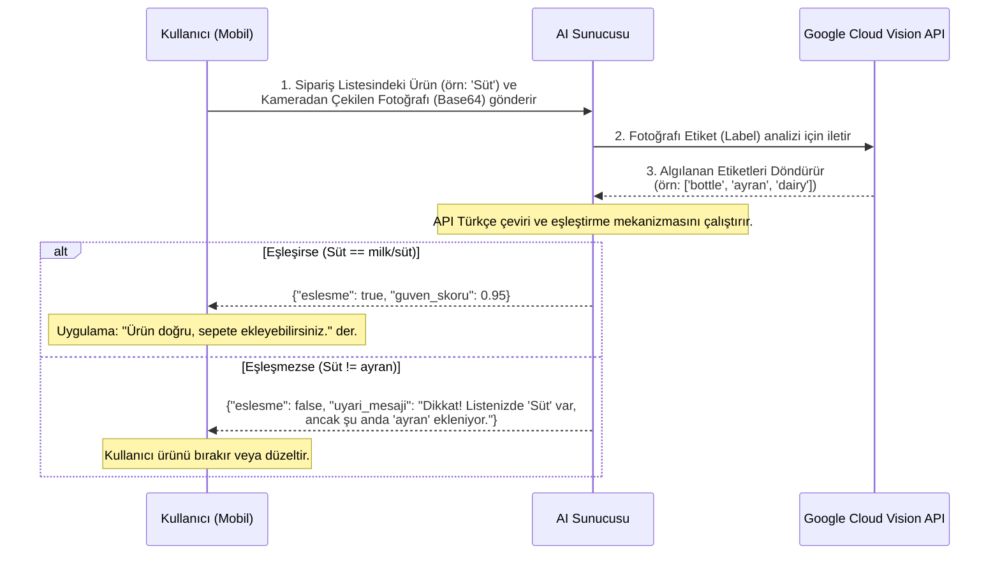

# GörenSepet Proje İş Akışı ve Mimari Çarkı

Aşağıdaki şemada GörenSepet (Engelsiz Alışveriş) uygulamasının tüm bileşenlerinin birbiriyle nasıl konuştuğunu ve kullanıcı (Görme Engelli Birey) ile nasıl etkileşime girdiğini görebilirsiniz.

## Genel Mimari ve Kullanıcı Akış Şeması

## Spesifik Akışlar: Yapay Zeka Ürün Doğrulama Süreci
Ürün doğrulama aşamasında yapay zekanın (Google Cloud Vision ve FastAPI arkasında) arka planda nasıl karar verdiği aşağıda detaylandırılmıştır.

Bu şemalar, GörenSepet'in dört ana direğini (Mobil Girdi, Supabase Yönetimi, Yapay Zeka Beyni, Sesli Geri Bildirim) özetlemektedir. Mimarinin genişletilmesi veya yeni fonksiyonlar eklenmesi planlanıyorsa, bu çark üzerinden referans alınabilir.
